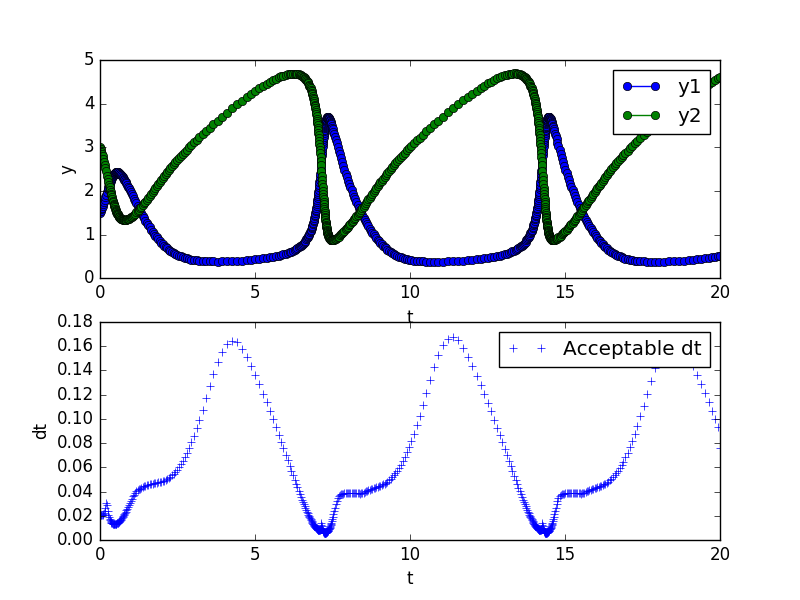

The generic_rk module is an attempt to modularize solvers for ordinary differential equations (ODEs) in Fortran.

Below is the result of an example problem known as the Brusselator using an adaptive timestep control. The first subplot shows the raw results of $y_1$ and $y_2$ within the range $t \in [0, 20]$. The second subplot shows the acceptable $dt$ used throughout the simulation.

$$
\begin{array}{r l}
y_1' &=& 1 + y_1^2 y_2 -4y_1 \\
y_2' &=& 3y_1 - y_1^2 y_2 \\
\end{array}
$$

$$ y_1(0) = 1.5, ~~~ y_2(0) = 3, ~~~ t \in [0, 20]$$

{: height="100px"}
